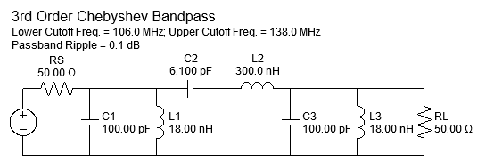
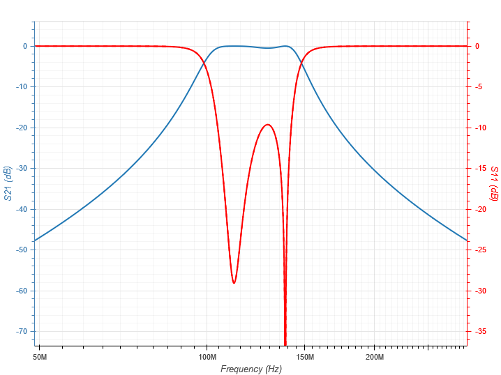

# Filtros
Objetivo desses filtros é:
- Realizar a filtragem inicial, mantendo apenas a faixa de interesse do rádio, com um baixa perda de inserção
- Executar uma segunda filtragem a fim de manter apenas o espectro de interesse do canal.

#### Especificações 

- Range de frequência : 108 a 136,9917 MHz
- Espaçamento entre os canais : 8.33 ou 25 KHz
- Largura de banda do canal: 7,5 KHz
- FI em 375 KHz, proposta de filtro

