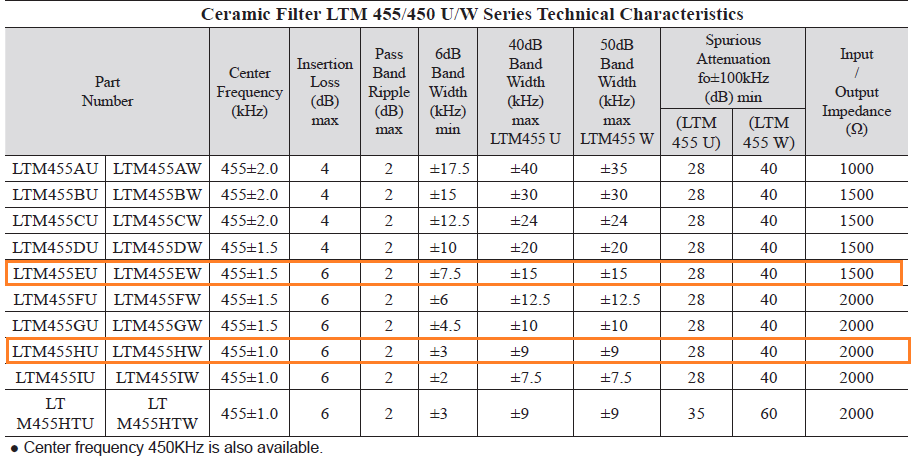
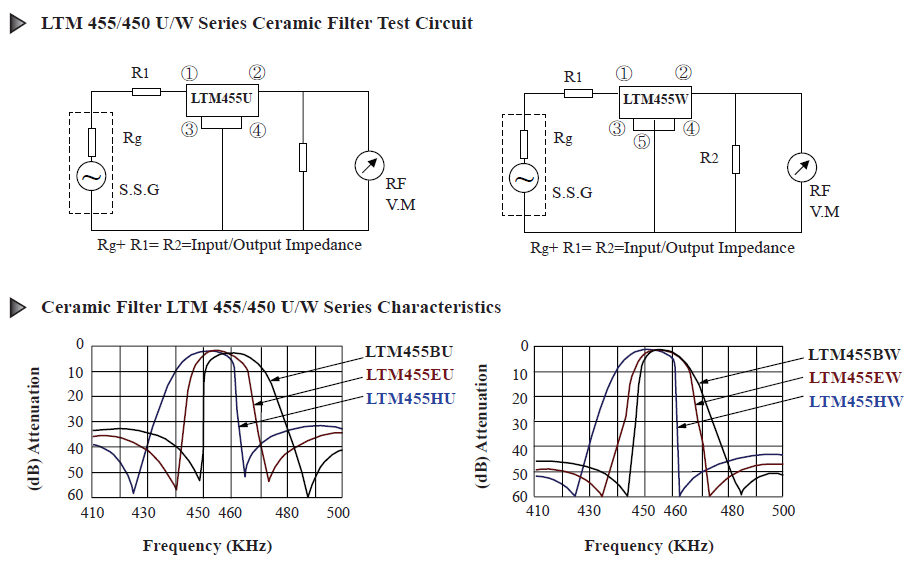

# Filtros
Objetivo desses filtros é:
- Realizar a filtragem inicial, mantendo apenas a faixa de interesse do rádio, com um baixa perda de inserção (RF filter)
- Executar uma segunda filtragem a fim de manter apenas o espectro de interesse do canal (IF Filter).

#### Especificações 

- Range de frequência : 108 a 136,9917 MHz
- Espaçamento entre os canais : 8.33 ou 25 KHz
- Largura de banda do canal: 3 ou 7,5 KHz
- FI em 455 KHz

### Primeiro filtro

Filtro passivo, do tipo chebyshev. Este filtro foi escolhido como passivo pois deve ser capaz de atuar em potências relativamente altas, já que, ele deve filtrar sinais de alto potência fora da faixa de operação de rádio. Deve ter baixa perda de inserção pois está no início do circuito, o que representa uma atenuação maior no sinal resultante. Além disso não precisa ser extremamente seletivo porque ocorrerá ainda uma segunda filtragem, sua principal função é retirar sinais de alta potência que não são de interesse a fim de evitar a saturação dos componentes posteriores do circuito (blocos de ganho, atenuadores, mixers etc).

### Segundo filtro

Filtro ativo, já que a potência de entrada é controlada pelo resto do circuito. Com alta seletividade, centrado em 455KHz. Haverá uma chave de RF para alternar entre os filtros, definindo assim a largura do canal.

