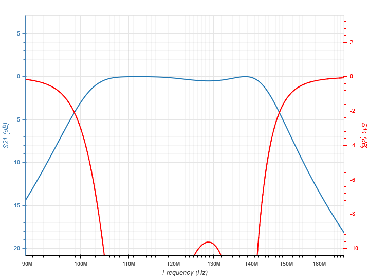
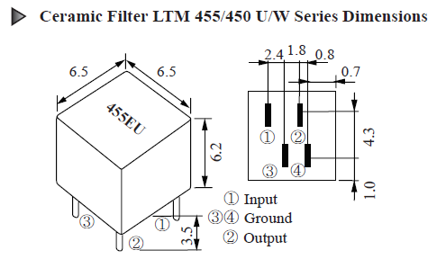

# Filtros
Objetivo desses filtros é:
- Realizar a filtragem inicial, mantendo apenas a faixa de interesse do rádio, com um baixa perda de inserção (RF filter)
- Executar uma segunda filtragem a fim de manter apenas o espectro de interesse do canal (IF Filter).

### Especificações 

- Range de frequência (faixa passante do primeiro filtro) : 108 a 136,9917 MHz
- Espaçamento entre os canais : 8.33 ou 25 KHz (seletividade de 60dB)
- Largura de banda do canal: 3 ou 7,5 KHz (seletividade de 6dB)
- FI em 455 KHz
- Impedância: 50 Ohm

## Primeiro filtro

Filtro passivo, do tipo chebyshev. Este filtro foi escolhido como passivo pois deve ser capaz de atuar em potências relativamente altas, já que, ele deve filtrar sinais de alto potência fora da faixa de operação de rádio. Deve ter baixa perda de inserção pois está no início do circuito, o que representa uma atenuação maior no sinal resultante. Além disso não precisa ser extremamente seletivo porque ocorrerá ainda uma segunda filtragem, sua principal função é retirar sinais de alta potência que não são de interesse a fim de evitar a saturação dos componentes posteriores do circuito (blocos de ganho, atenuadores, mixers etc).

### Filtro Teórico com valores comerciais

#### Componentes do filtro real:

- GRM1555C1H6R2DZ01D
- GRM1555C1H101JA01D
- LQG15HSR27J02D
- LQG15HS18NJ02D

### Simulação do filtro utilizando componentes reais

Utilizando os modelos reais dos componentes, o filtro foi simulado no AWR.

## Segundo filtro

Filtro cerâmico, já que a potência de entrada é controlada pelo resto do circuito. Com alta seletividade, centrado em 455KHz. Haverá uma chave de RF para alternar entre os filtros, definindo assim a largura do canal. O filtro abaixo foi escolhido pois atende as nossas especificações, é pequeno e não necessita de circuito externo nem alimentação.

### Simulação do segundo filtro no AWR

Para simular o segundo filtro, foi escolhido um filtro elíptico ideal com as mesmos parâmetros do filtro real. Foi escolhido o tipo elíptico devido a semelhança com a resposta. Os filtro se encontram nesse repositório e serão utilizados na simulação do bloco de recepção como um todo.

Filtro para largura de canal de 7,5kHz com espaçamento de 25kHz.

Filtro para largura de canal de 3kHz com espaçamento de 8,33kHz.

